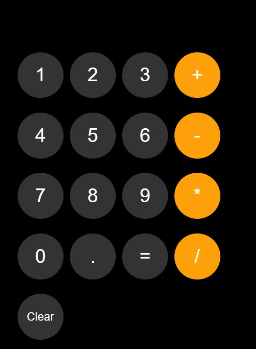
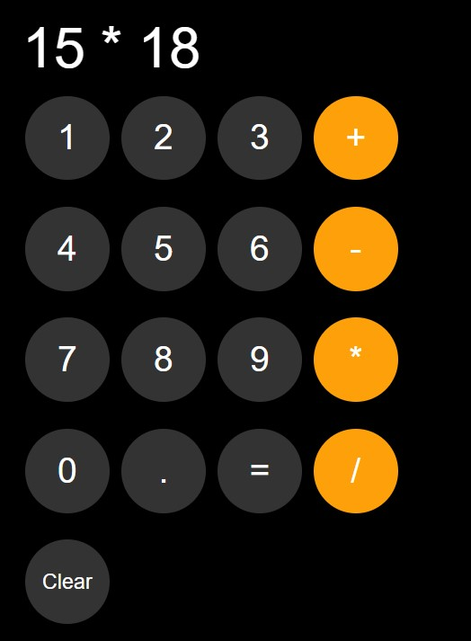
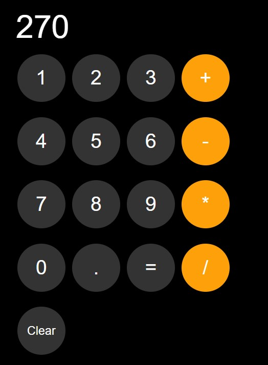

# Project Screenshots

***Project: MyCalculator***

This HTML document represents a basic calculator interface.  
Users can perform arithmetic operations such as addition, subtraction, multiplication, and division by clicking on the respective buttons.  
The calculator displays the input and the result in a clear format, providing a simple and interactive way to perform calculations.

## Initial Calculator State ## 
*The calculator's initial state features a sleek black display, ready for user input and arithmetic operations.*

## Calculator in Use ##
*The calculator in action, showcasing a multiplication operation on the display, highlighting its real-time calculation capabilities.*

## Calculator with Result of Operation ##
*The calculator displaying the accurate result of a multiplication operation, demonstrating its ability to provide precise calculations.*

